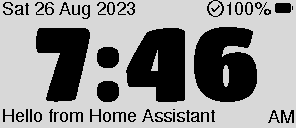

# eClock — a low-power ePaper clock

An inexpensive, reliable ePaper clock that keeps you on time — not by nagging, but
by keeping time (and what you need to remember) in your peripheral vision. Its big,
always-on ePaper display and customizable daily reminders give you the situational
awareness to walk out the door when you meant to — and the fact that it started life
as a bedtime-clock for getting to Sunday service on time is purely coincidental.

It shows accurate time on an always-on ePaper panel, runs for months on a single
small LiPo, and keeps that time correct by syncing its clock from Home Assistant over
Bluetooth Low Energy.

> **⚠️ Not a standalone clock — Home Assistant is required.**
> The clock has **no Real-Time Clock (RTC) and no time source of its own**. It only
> ever shows the time that Home Assistant writes to it over BLE (once at boot, then
> hourly, and after every wake from sleep). Without a working Home Assistant setup it
> has no way to know the time — it will sit on a "Syncing…" / "No Time!" screen and
> will not keep time on its own. **Home Assistant is not optional: it is the clock's
> time source.** Before you evaluate or deploy this clock, set up the Home Assistant
> integration first (see [Home Assistant time sync](#home-assistant-time-sync) below).
>
> *If you want a clock that keeps time with no other infrastructure, this project is
> not that — a self-contained clock needs a different hardware/software design.*

Status: **Phase 6 — review & polish.** Firmware, BLE time sync (device + Home
Assistant side), power-budget modelling and a 98%-coverage host test harness are all
committed and working. See [the project plan](docs/PROJECT_PLAN.md) and
[where things actually stand today](docs/STATUS.md).

> **Using one?** Read the [User Guide](docs/USER_GUIDE.md) — what the screen says, what
> every icon means, and how to use the buttons. If this is a stock clock you've been
> given, that page is for you.

## Screenshots

These are real renders of the ePaper output, produced by the host test harness
(`firmware/test/`) — the syncing page while the clock waits for its first Home
Assistant time sync, and the running clock face once it has time.

| Syncing | Time | Time + message |
| --- | --- | --- |
|  |  |  |

Every sync/power icon combination is shown in
[`docs/screenshots/state_matrix_approval.png`](docs/screenshots/state_matrix_approval.png).

## Design goals

- Large, readable display — the time is readable at a glance from across a room,
  giving constant situational awareness without demanding attention.
- Customizable daily reminders — Home Assistant can push short messages (a weekly
  reminder, an anniversary, "bin day tomorrow"…) onto the bottom of the display, so
  the important things are visible without needing to pull out a phone.
- Battery life measured in months, not days, with a usable low-battery warning.
- Correct time without user intervention (via Home Assistant), including across
  daylight saving changes.
- Reproducible by someone else from the documentation in this repo.
- Fully open source: firmware, enclosure, and build instructions.

## Documentation

- [User Guide](docs/USER_GUIDE.md) — what the screen says, what every icon means, and how
  to use the buttons (for anyone *using* a clock).
- [Build & setup](docs/SETUP.md) — verified install, build, flash and monitor steps for
  a developer machine.
- [Project plan](docs/PROJECT_PLAN.md) — the phased development plan and success criteria.
- [Status](docs/STATUS.md) — where the project actually stands today.
- [Hardware pinout](docs/hardware/PINOUT.md) — pin mappings, power control, and board
  traps (read this before wiring or writing display code).
- [State machine design](docs/design/state-machine.md) — the firmware's five-state
  design, every transition and trigger, and how it interacts with BLE/buttons/battery/
  power. **Start here for the system design.**
- [Lessons learned](docs/lessons/LESSONS_LEARNT.md) — accumulated hard-won findings from
  each development session.
- [Power budget](docs/research/power-budget-analysis.md) — the six-term energy model and
  the battery-life estimate.
- [Research tracking](docs/research/RESEARCH_TRACKING.md) — open questions, their answers,
  and what still needs proving.
- [Font generation](docs/reference/FONT_GENERATION.md) — how the custom time font and
  icons were generated.
- [Test checklists](docs/testing/PHASE1_CHECKLIST.md) — the Phase 1/2 display test
  checklists (`docs/testing/`).
- [Enclosure notes](docs/enclosure/DESIGN_NOTES.md) — enclosure design considerations.
- [Home Assistant integration](integrations/homeassistant/README.md) — the **required**
  BLE time-sync custom component (the clock's only time source).

## Hardware

| Part | Detail |
| --- | --- |
| Microcontroller | Seeed Studio XIAO nRF52840 |
| Display shield | Seeed Studio XIAO ePaper Display Board (EN05) |
| Display panel | 2.9" monochrome ePaper, 296 × 128 (landscape), GDEY029T94 / FPC-A005 |
| Panel controller | SSD1680 |
| Battery | Rechargeable LiPo, 500 mAh |
| Enclosure | 3D printed, designed in OnShape |

Pinout, power-rail gotchas, and board-specific traps are documented in
[the hardware pinout](docs/hardware/PINOUT.md). Read that before wiring or writing
display code — the EN05 does not talk to the panel over the visible header pins.

## Where to buy

The recommended kit bundles the XIAO BLE nRF52840 board, the EN05 ePaper display
board, and the 2.9" panel together:

- **Seeed Studio XIAO ePaper DIY Kit (nRF52840 + EN05)** —
  <https://www.seeedstudio.com/XIAO-ePaper-DIY-Kit-nRF52840-EN05.html>

The parts can also be bought separately (XIAO nRF52840 board + EN05 ePaper display
board + 2.9" monochrome ePaper panel). A 500 mAh LiPo and a 3D-printed enclosure are
supplied or printed separately.

## Repository layout

```
docs/
  PROJECT_PLAN.md            Phased development plan and success criteria
  STATUS.md                  Current phase, what is done, what is next
  SETUP.md                   Verified build/flash/monitor instructions
  USER_GUIDE.md              How to use the clock: screens, icons, buttons, troubleshooting
  hardware/PINOUT.md         Pin mappings, power control, board traps
  hardware/datasheets/       Vendor docs — NOT committed, see README there
  design/state-machine.md    Firmware state machine (system design reference)
  lessons/LESSONS_LEARNT.md  Accumulated hard-won findings
  lessons/TEMPLATE.md        Per-session log template
  research/                  Open research questions and their answers
  testing/                   Test checklists
  enclosure/                 Enclosure design notes
  screenshots/               Real ePaper renders (from firmware/test/) used in this README
firmware/
  platformio.ini             Two envs: adafruit and mbed (default = mbed; the current firmware is mbed-only)
  src/main.cpp               Clock firmware: state machine, BLE time sync, ePaper display, power management
  include/board_pins.h       EN05 pin map, per-core
  tools/                     Flash and serial-capture helpers
hardware/enclosure/          (Phase 5) OnShape exports — not yet created
integrations/homeassistant/  Home Assistant custom component for BLE time sync
```

Note on vendor documentation: the Seeed and Good Display datasheets, schematic and PCB
archives are proprietary and are **not** included in this repository. See
[the datasheets README](docs/hardware/datasheets/README.md) for what to download and
where. Everything this project learned from them is written up in plain terms in
[the hardware pinout](docs/hardware/PINOUT.md).

## Home Assistant time sync

**Home Assistant is the clock's time source — it is required, not optional.** The
clock cannot keep or display time on its own (it has no RTC), so before the clock is
usable you must install the integration in Home Assistant and have it reachable via BLE.

> **Minimum requirement to use the clock:** a Home Assistant instance with **Bluetooth
> enabled**, the `epaper_clock` custom component installed, powered on, and in BLE range
> of the clock. The clock does the discovery; the integration pushes the time. Without
> this, the clock cannot proceed past its sync/waiting screen.

`integrations/homeassistant/custom_components/epaper_clock/` contains the custom
component that discovers the clock by BLE advertisement and writes the current epoch
plus UTC offset to the standard Current Time characteristic (`0x2A2B`). It exposes an
`epaper_clock.sync_time` service for manual resyncs. The device and host sides were
validated end-to-end in Phase 4 — see `docs/STATUS.md`.

It can also push a short **bottom message** to the clock (e.g. a holiday greeting or
a weekly reminder) via a separate additive characteristic, configured with a
`messages:` list in `configuration.yaml`. See
`integrations/homeassistant/README.md` and
`docs/research/message-feature-design.md` for the config and the selection rules.

## Building, flashing and testing from the command line

All steps work from a plain shell (PowerShell on Windows 11, or any POSIX shell) with
no IDE required. Windows-specific notes are inline.

### Exploring the codebase with CodeGraph (optional)

This repository supports [CodeGraph](https://github.com/colbymchenry/codegraph)
for source-code discovery. Developers and coding agents should use it first when it is
available for repository summaries, architecture exploration, symbol lookup, call
relationships, change-impact analysis, and affected-test discovery. It is optional:
direct source and documentation inspection remains the fallback.

```bash
codegraph status .                                      # check index availability/freshness
codegraph sync .                                        # update a stale index
codegraph files -p . --format grouped                   # indexed source structure
codegraph explore -p . --max-files 12 "BLE sync flow"  # source plus relationships
codegraph query -p . "startSyncAttempt"                # find a symbol
codegraph node -p . "startSyncAttempt"                 # source and caller/callee trail
```

CodeGraph indexes code and selected configuration files, not the complete prose docs
or generated artifacts. Pair its results with `README.md`, `docs/STATUS.md`, the
relevant design documents, and Git/filesystem inspection. Repository-specific agent
instructions and further commands are in [`AGENTS.md`](AGENTS.md).

### Prerequisites

- **PlatformIO Core** (`pip install platformio`, then `pio --version`).
- **Python 3** with `pyserial` for the reset helper (`pip install pyserial`).
- **CMake + Ninja + a GCC toolchain** (MinGW-w64) for the host unit tests. On Windows:
  `winget install BrechtSanders.WinLibs.POSIX.UCRT` (ships `gcc`/`g++`/`gcov`) and
  `pip install ninja cmake`. `gcovr` is optional, only for the coverage report.
- A connected XIAO nRF52840 + EN05 board. The bootloader (`2886:0064`) and the running
  application (`2886:8045`) enumerate as **two different COM ports** — list them with:

  ```bash
  python -c "import serial.tools.list_ports as l; [print(p.device, hex(p.pid), p.description) for p in l.comports()]"
  ```

### Build the firmware (PlatformIO)

The current firmware is **mbed-core only** — `main.cpp` hard-requires it, so the
`adafruit` env will not compile (`default_envs = mbed` in `platformio.ini`):

```bash
cd firmware
pio run -e mbed
```

The first build downloads the platform and toolchain (a few hundred MB) and takes a few
minutes; later builds are seconds. Flash/RAM usage is printed at the end (≈360 KB /
45.4% flash, ≈73 KB / 31.5% RAM).

### Run the host unit tests (no hardware needed)

The firmware's state machine, time math, battery logic and display drawing compile and
run natively on your machine (`firmware/test/`) with ≥98% line coverage, and dump the
clock face as real PNGs:

```bash
cmake -S firmware/test -B firmware/test/build -G Ninja
cmake --build firmware/test/build
ctest --test-dir firmware/test/build --output-on-failure
```

On Windows, the build also copies the MinGW runtime DLLs (`libstdc++-6.dll`,
`libgcc_s_seh-1.dll`, `libwinpthread-1.dll`) next to each test executable, so ctest
runs from a clean shell without needing them on PATH. (If you already have a build dir
from before this change, re-run the `cmake -S ...` configure step once to pick it up.)

PNG renders land in `firmware/test/output/`. For a coverage report:

```bash
uv tool install gcovr     # once, if not already installed
cmake --build firmware/test/build --target coverage   # HTML in build/output/coverage/
```

### Flash the firmware

Two paths:
1. **UF2 drag-and-drop:** Double-tap RESET to mount the `XIAO-BOOT` drive, and copy the `.uf2` file over. **CRITICAL:** The bootloader's FAT16 filesystem does not support Long File Names (LFN). Copying a file with a name longer than 8.3 characters (like `eClock-v0.1.0.uf2`) will crash the bootloader mid-transfer. The GitHub releases provide an 8.3 compliant `ECLOCK.UF2` to avoid this.
2. **Serial DFU:** (Alternative reliable path).

**Serial DFU (reliable here):**

```bash
cd firmware
python tools/find_board.py            # optional: see which COM the XIAO is on
python tools/reset_to_bootloader.py   # if running the app: reboots into bootloader
pio run -e mbed -t upload --upload-port <bootloader port>  # e.g. COM8
```

A successful upload ends with `Device programmed.`, and the board re-enumerates as the
running application on its application COM port. If the helper can't find the board,
**double-tap the RESET button** to force the bootloader manually.

> **Flashing the firmware is not the end.** A freshly-flashed board just sits on the
> "Syncing…" screen — it has no time until it receives it from Home Assistant. After
> flashing, set up the Home Assistant integration and bring it within BLE range; until
> it syncs, the clock will not show a time. See
> [Home Assistant time sync](#home-assistant-time-sync).

See the [full setup guide](docs/SETUP.md) for the build/flash/monitor flow, the
[Home Assistant integration README](integrations/homeassistant/README.md) for installing
and configuring the time sync, the [hardware pinout](docs/hardware/PINOUT.md) before
wiring anything, and the [status](docs/STATUS.md) for where the project stands today.
All the docs are linked from [Documentation](#documentation) above.

## CI & secret scanning

Every push / pull request runs [GitHub Actions](.github/workflows/ci.yml) with three
jobs:

- **Secret scan** — runs `gitleaks` across the full git history; fails on any detected
  credential, token, or private key.
- **Firmware build** — `pio run -e mbed` on a clean runner, so the shipped firmware is
  confirmed to compile.
- **Host unit tests + coverage** — builds and runs the `firmware/test` fixture
  (`ctest`), then generates a `main.cpp` coverage report and uploads it as a CI
  artifact for 14 days.

A separate [`.github/workflows/release.yml`](.github/workflows/release.yml) runs when a
release is published (or a `v*` tag is pushed): it injects the tag as the firmware
version, builds the mbed firmware, and attaches a versioned **`.uf2`** (drag-and-drop onto
the bootloader), **`.hex`** (serial-DFU flash artifact), and **`.elf`** (for debugging) to
the release. The injected version is shown at the bottom left of the clock's syncing
screen, so the flashed build is always identifiable.

Locally, a [`.pre-commit-config.yaml`](.pre-commit-config.yaml) runs the same gitleaks
secret scan (plus trailing-whitespace, end-of-file, YAML, large-file, private-key and
merge-conflict checks) on every staged commit. Install once with
`pip install pre-commit && pre-commit install`, or trigger manually with
`pre-commit run --all-files`.

## Author

Built by **Jason Tranter** ([@JPTranter](https://github.com/JPTranter)). This is a
personal low-power ePaper clock project — designed, built and tested in the spare
hours it took to make something that simply works, every day, on time.

## License

MIT — see `LICENSE`.
