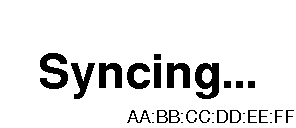

# eClock — a low-power ePaper clock

An inexpensive, reliable ePaper clock built to solve one specific problem: helping
people leave the house on time for church. It shows accurate time on an always-on
ePaper panel, runs for months on a single small LiPo, and optionally syncs its clock
from Home Assistant over Bluetooth Low Energy.

Status: **Phase 6 — review & polish.** Firmware, BLE time sync (device + Home
Assistant side), power-budget modelling and a 98%-coverage host test harness are all
committed and working. See `docs/PROJECT_PLAN.md` for the phase plan and
`docs/STATUS.md` for where things actually stand today.

> **Using one?** Read the [User Guide](docs/USER_GUIDE.md) — what the screen says, what
> every icon means, and how to use the buttons. If this is a stock clock you've been
> given, that page is for you.

## Screenshots

These are real renders of the ePaper output, produced by the host test harness
(`firmware/test/`) — the syncing page while the clock waits for its first Home
Assistant time sync, and the running clock face once it has time.

| Syncing | Time |
| --- | --- |
|  |  |

## Design goals

- Readable at a glance from across a room.
- Battery life measured in months, not days, with a usable low-battery warning.
- Correct time without user intervention, including across daylight saving changes.
- Reproducible by someone else from the documentation in this repo.
- Fully open source: firmware, enclosure, and build instructions.

## Hardware

| Part | Detail |
| --- | --- |
| Microcontroller | Seeed Studio XIAO nRF52840 |
| Display shield | Seeed Studio XIAO ePaper Display Board (EN05) |
| Display panel | 2.9" monochrome ePaper, 296 × 128 (landscape), GDEY029T94 / FPC-A005 |
| Panel controller | SSD1680 |
| Battery | Rechargeable LiPo, 500 mAh |
| Enclosure | 3D printed, designed in OnShape |

Pinout, power-rail gotchas, and board-specific traps are documented in
`docs/hardware/PINOUT.md`. Read that before wiring or writing display code — the
EN05 does not talk to the panel over the visible header pins.

## Repository layout

```
docs/
  PROJECT_PLAN.md            Phased development plan and success criteria
  STATUS.md                  Current phase, what is done, what is next
  SETUP.md                   Verified build/flash/monitor instructions
  USER_GUIDE.md              How to use the clock: screens, icons, buttons, troubleshooting
  hardware/PINOUT.md         Pin mappings, power control, board traps
  hardware/datasheets/       Vendor docs — NOT committed, see README there
  lessons/LESSONS_LEARNT.md  Accumulated hard-won findings
  lessons/TEMPLATE.md        Per-session log template
  research/                  Open research questions and their answers
  testing/                   Test checklists
  enclosure/                 Enclosure design notes
  screenshots/               Real ePaper renders (from firmware/test/) used in this README
firmware/
  platformio.ini             Two envs: adafruit and mbed (default = mbed; the current firmware is mbed-only)
  src/main.cpp               Clock firmware: state machine, BLE time sync, ePaper display, power management
  include/board_pins.h       EN05 pin map, per-core
  tools/                     Flash and serial-capture helpers
hardware/enclosure/          (Phase 5) OnShape exports — not yet created
integrations/homeassistant/  Home Assistant custom component for BLE time sync
```

Note on vendor documentation: the Seeed and Good Display datasheets, schematic and PCB
archives are proprietary and are **not** included in this repository. See
`docs/hardware/datasheets/README.md` for what to download and where. Everything this
project learned from them is written up in plain terms in `docs/hardware/PINOUT.md`.

## Home Assistant time sync

`integrations/homeassistant/custom_components/epaper_clock/` contains a custom
component that discovers the clock by BLE advertisement and writes the current epoch
plus UTC offset to the standard Current Time characteristic (`0x2A2B`). It exposes an
`epaper_clock.sync_time` service for manual resyncs. This host-side code is drafted
but has not been re-validated against committed firmware — see `docs/STATUS.md`.

## Building, flashing and testing from the command line

All steps work from a plain shell (PowerShell on Windows 11, or any POSIX shell) with
no IDE required. Windows-specific notes are inline.

### Prerequisites

- **PlatformIO Core** (`pip install platformio`, then `pio --version`).
- **Python 3** with `pyserial` for the reset helper (`pip install pyserial`).
- **CMake + Ninja + a GCC toolchain** (MinGW-w64) for the host unit tests. On Windows:
  `winget install BrechtSanders.WinLibs.POSIX.UCRT` (ships `gcc`/`g++`/`gcov`) and
  `pip install ninja cmake`. `gcovr` is optional, only for the coverage report.
- A connected XIAO nRF52840 + EN05 board. The bootloader (`2886:0064`) and the running
  application (`2886:8045`) enumerate as **two different COM ports** — list them with:

  ```bash
  python -c "import serial.tools.list_ports as l; [print(p.device, hex(p.pid), p.description) for p in l.comports()]"
  ```

### Build the firmware (PlatformIO)

The current firmware is **mbed-core only** — `main.cpp` hard-requires it, so the
`adafruit` env will not compile (`default_envs = mbed` in `platformio.ini`):

```bash
cd firmware
pio run -e mbed
```

The first build downloads the platform and toolchain (a few hundred MB) and takes a few
minutes; later builds are seconds. Flash/RAM usage is printed at the end (≈361 KB /
44.6% flash, ≈74 KB / 31.5% RAM).

### Run the host unit tests (no hardware needed)

The firmware's state machine, time math, battery logic and display drawing compile and
run natively on your machine (`firmware/test/`) with ≥98% line coverage, and dump the
clock face as real PNGs:

```bash
cmake -S firmware/test -B firmware/test/build -G Ninja
cmake --build firmware/test/build
ctest --test-dir firmware/test/build --output-on-failure
```

PNG renders land in `firmware/test/output/`. For a coverage report:

```bash
uv tool install gcovr     # once, if not already installed
cmake --build firmware/test/build --target coverage   # HTML in build/output/coverage/
```

### Flash the firmware (serial DFU)

Use serial DFU, not UF2 drag-and-drop (the bootloader's mass-storage drive does not
remount reliably). Two steps — the reset helper prints the bootloader port:

```bash
cd firmware
python tools/reset_to_bootloader.py                      # prints the bootloader port
pio run -e mbed -t upload --upload-port <bootloader port>  # e.g. COM6
```

A successful upload ends with `Device programmed.`, and the board re-enumerates as the
running application on its application COM port. If the helper can't find the board,
**double-tap the RESET button** to force the bootloader manually.

See `docs/SETUP.md` for the full setup guide, `docs/hardware/PINOUT.md` before wiring
anything, and `docs/STATUS.md` for where the project stands today.

## License

MIT — see `LICENSE`.
