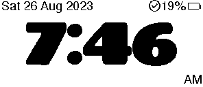

# eClock User Guide

> You'll never be late for church again.

The eClock is a small, low-power ePaper clock that does one thing brilliantly: it
shows you the time, clearly, at a glance — and keeps running for months on a single
small battery. It never needs winding, and it even corrects itself for daylight
saving.

This guide covers everything you need to use one day-to-day: what the screen is
telling you, what the little icons mean, and how to use the buttons. Every screen
shown here is a real render of what the clock displays.

---

## The screen at a glance

The display always shows one of four screens. Here's what each one looks like and
what it means.

### The clock face (the one you'll see every day)

| Where | What it is |
| --- | --- |
| **Top left** | Today's date |
| **Top right** | A single group: sync status, battery charge (see "Icons" below) |
| **Middle** | The time — big, bold, and readable from across the room |
| **Bottom** | A message (e.g. a holiday greeting) — see "Messages" below; otherwise blank |
| **Bottom right** | AM or PM |

### The syncing screen (first few seconds after power-on)

The clock is waiting for a Home Assistant device to send it the correct time. The
address at the bottom right is its Bluetooth address — used once, when you first set
up the sync. If you have Home Assistant, it will lock on almost immediately; the
clock face appears as soon as it has a valid time.

### The "No Time!" screen (only if it can't sync)

The clock booted but nobody sent it the time within a few seconds. Don't worry —
just press any button and it will try again. This screen rarely appears once setup is
complete.

### The sleep screen (overnight)

Between **11pm and 5am** the clock turns its display off to save battery and shows a
big **"Zzz"** with the word *Sleeping* beneath it. It wakes itself at 5am, fully
synced and ready for the day. Pressing a button during sleep wakes it immediately
(see "Buttons" below).

---

## The icons, translated

The small symbols on the clock face are your status panel. Here's every one of them,
described as you actually see them on the panel.

### Battery (top right)

| What you see | Meaning |
| --- | --- |
| **A battery icon with a number, e.g. `85%`** | Running on battery. The number is roughly how much charge is left. |
| **A lightning-bolt icon** | Plugged into USB / charger. It's charging — no percentage shown because it's running off the wire, not the cell. |
| **An *empty* battery icon (no fill) with a low number** | Battery running low — **charge it soon** (see "Charging" below). |

Because the panel barely uses power, a full charge lasts months — you'll rarely think
about the battery. But the clock gives you two clear heads-ups before it runs out
(see **Charging** below), so you're never caught off guard.

### Sync status (top right)

The sync status icon sits in the top-right group, next to the battery. When the last
sync **failed**, the clock also shows the time of the **last successful sync** (e.g.
`09:41`) so you know how stale the time is — otherwise just the icon shows.

| What you see | Meaning |
| --- | --- |
| **A white circle with a tick / check mark** | Sync is good. The clock has the correct, up-to-date time. This is the normal "happy" state — you'll see this almost all the time. |
| **A pair of circular arrows** | The clock is syncing right now — it's talking to Home Assistant for the correct time. |
| **A circle with an X / cross** | The last sync failed, showing the last-sync time. The clock still shows the time it has, but it couldn't reach Home Assistant for an update. It'll retry once an hour on its own (or immediately if you press a button). |

### Messages

If configured (via Home Assistant), a short message appears on the bottom row — e.g.
"Merry Christmas", "Happy Birthday Sam", or a weekly reminder like "Thank God it's
Friday!". A more specific date (one-off, then annual) wins over a weekday message,
which wins over a default message. When nothing applies, the bottom row is blank
(normal clock face). Messages are capped at 30 characters so they never crowd the
AM/PM display.

---

## Charging

The clock runs for months on its little battery, so charging is a rare chore. But
because the screen is *ePaper*, it can keep showing an image even when the clock has
run out of power — which is why the clock warns you clearly **before** that happens,
so you never end up trusting a frozen time.

### The two heads-ups

**1. Low-battery icon (a few weeks left).** When the battery drops to about 20%, the
battery icon at the top right goes from a full battery to an **empty battery**, and
the number drops. That's your cue to plug it in sometime in the next week or two.

**2. The final "LOW BATTERY" screen (about the last bit of juice).** If the battery
gets down to the last few percent, the clock replaces the clock face entirely with
this:

The moment you see this, **it's time to charge now.** Because this message is drawn
onto the ePaper panel and the panel holds its image without power, it stays right
there even if the clock then runs completely flat — so a dead clock clearly reads
"charge me," never a time that might be wrong.

### How to charge

Plug a standard USB-C cable into the port on the clock. The screen switches to a
lightning-bolt icon while it's charging. A fresh charge lasts months, so leave it
plugged in for an hour or two and you're set — the clock re-syncs itself the moment
it's back on power.

---

## Using the buttons

There are three buttons on the board. For everyday use, they all do the same thing:
**press any of them to tell the clock "you're here" and give it a nudge.**

| Situation | What the button does |
| --- | --- |
| Screen shows "No Time!" | Immediately retries the sync. |
| Middle of the day | Hands-on check — keeps the display fresh. |
| During sleep (night) | Wakes the display up and **keeps it on until the next 11pm**, so it won't go back to sleep if you're up late. Press it again and it stays awake for you. |

That's it. There's nothing to program and nothing to fiddle with — the clock handles
itself, and the buttons are there for the rare moment you need to nudge it.

---

## Everyday use in three sentences

1. It shows the time. Big and clear.
2. It updates itself from Home Assistant, so it's always right — even through daylight
   saving.
3. It sleeps at night to save power and wakes itself at 5am.

Just glance at it on your way out the door. You'll be on time.

---

## First-time setup (for the person building it)

> Hand this part to whoever built your clock — it's the one-time configuration they
> do for you.

The clock gets its time from Home Assistant over Bluetooth. To pair it:

1. Add the custom component from `integrations/homeassistant/` to your Home Assistant.
2. Note the clock's Bluetooth address — it's shown on the syncing screen (bottom
   right) the first time you power it on.
3. Configure the component with that address. It will advertise the clock's presence
   and write the current time to it automatically.
4. The clock switches to the clock face the moment it receives a valid time.

Until a device is paired, the clock simply keeps asking for a sync — it won't run
ahead or drift, it just waits patiently.

---

## Caring for the display

- **The screen keeps its image without power** — that's what makes it so frugal. You
  can pull the battery and the last thing it showed stays put. That's also why the
  low-battery screens are so important: unless the clock draws a clear "charge me"
  message first, a dead clock could otherwise look like a live one that just stopped.
  See **Charging** for the two warnings it gives you.
- **Avoid pressing hard on the panel.** It's a glass display; a gentle touch is all it
  needs.
- **Charge it with a standard USB cable** — the clock handles the rest and re-syncs
  itself when power returns.

---

## Troubleshooting

| Symptom | What it means | What to do |
| --- | --- | --- |
| Shows "No Time!" | Home Assistant hasn't sent a time yet | Press any button to retry; check HA pairing. |
| Cross icon (sync failed) | It couldn't reach HA for an update | Make sure HA is on and within Bluetooth range; it retries once an hour automatically (press a button for an immediate retry). |
| Empty-battery icon + low % | Battery is low | Charge the clock (see **Charging**). |
| "LOW BATTERY" screen | Battery is nearly dead | **Charge now** — this screen stays until you do. |
| Bolt icon, no % | It's plugged in / charging | That's normal — it's on the charger. |
| "Zzz" at night | It's sleeping | Normal — it wakes itself at 5am (or on a button press). |

If the clock ever seems confused, give it a quick reset: unplug and replug power, and
it will re-sync all by itself.
