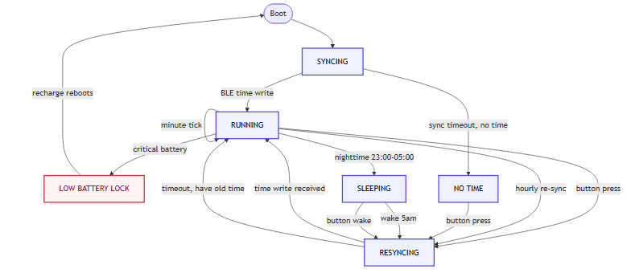

# The eClock State Machine

This is the single reference for how the eClock firmware transitions between its
behavioural states. It exists so a new engineer can understand the *system design*
from one place — the **why**, the **trigger conditions**, and **where each transition
is implemented** — without having to reconstruct it from `loop()` and a dozen lesson
documents.

> **Where the behaviour lives:** `firmware/src/main.cpp`. Everything below is grounded
> in the actual `loop()` (the state machine, lines ~422–600) and `setup()` (lines
> ~353–419). If a detail here disagrees with the code, the code wins — update this
> doc.

## The five states

| State | Meaning |
| --- | --- |
| `STATE_SYNCING` | Boot-time advertising. The clock is up but has **no valid time** yet; it is broadcasting so Home Assistant can discover it and write the current time. |
| `STATE_RUNNING` | Normal operation. The clock has a valid time, ticks the display once per minute, sleeps between ticks, and re-syncs hourly. |
| `STATE_RESYNCING` | A re-sync is in progress (manual button press or hourly interval, or on wake from sleep). The radio is advertising for an updated time. |
| `STATE_NO_TIME` | A sync attempt timed out and the clock **never had** a valid time. Empties to an error screen ("No Time!" / "Press any button to sync"). |
| `STATE_SLEEPING` | Overnight display-off (23:00–05:00). The panel rail is cut; the clock sleeps for the night and re-syncs on wake. |

> `STATE_SLEEPING` also has a **defensive** render in `drawClockFace()` (Zzz only) that
> is only reachable if a wake happens outside the sleep block — see below.

## State diagram



Rendered from [state-machine.mmd](state-machine.mmd). To regenerate — the renderer is
installed globally, not per-repo (Node 18+, Chromium cached on first use):

```bash
# one-time setup
npm install -g @mermaid-js/mermaid-cli     # provides the `mmdc` command
npx puppeteer browsers install chrome       # headless Chromium (cached; re-run if missing)

# regenerate the PNG from the source
mmdc -i docs/design/state-machine.mmd -o docs/design/state-machine.png -b white
```

If you edit the diagram, change the `.mmd`, re-render, and commit **both** the `.mmd`
and the `.png` together.

## Transitions

Every transition below is literal in `loop()`. "Side effects" are the concrete actions
taken on that transition.

| From | To | Trigger condition | Side effects |
| --- | --- | --- | --- |
| (boot) | `SYNCING` | Power-on / reset. `setup()` always starts in `STATE_SYNCING` and calls `startSyncAttempt()`. | Display draws "Syncing…"; BLE advertising started. |
| `SYNCING` | `RUNNING` | BLE characteristic write arrives (`timeCharacteristic.written()`, 8 bytes: int32 epoch + int32 tz). `loop()` §1. | `g_epoch`/`g_tz_offset` copied; clock snapped to `:00` (`g_last_tick_millis` anchored); radio stopped; green LED flash. |
| `SYNCING` | `NO_TIME` | Sync timeout expires (`millis() - g_sync_attempt_start >= SYNC_TIMEOUT`) **and** `g_epoch == 0` (never had a time). `loop()` §3. | `BLE.stopAdvertise()`; draws the "No Time!" / button-prompt screen. |
| `RUNNING` | `RUNNING` (self) | Minute boundary reached (`elapsed >= TICK_INTERVAL`). `loop()` §4. | `g_epoch += 60`; display redrawn. The first advance after a sync is partial (snaps to `:00`). |
| `RUNNING` | `RESYNCING` | Button press (debounced, and not already syncing). `loop()` §2. | `g_state = RESYNCING`; `startSyncAttempt()` (re-advertise). |
| `RUNNING` | `RESYNCING` | Hourly interval (`now - g_last_sync_millis >= SYNC_INTERVAL`). `loop()` §3. | Same as above — periodic re-sync one/hour. |
| `RUNNING` | `SLEEPING` | Nighttime (`isNighttime(local_sec)`, 23:00–05:00) **and** not being held awake (`(int32_t)(now - g_awake_until) >= 0`). `loop()` §3. | `enterSleepMode()`: draws Zzz + "Sleeping", stops radio, cuts panel rail (D6 LOW), blocks in WFE for 6 h. |
| `RUNNING` | `LOW BATTERY LOCK` | Critical battery (`isCriticalBattery(pct)`, ≤5%) and not already locked, and not on USB (`pct >= 0`). `loop()` §3. | `g_low_battery_lock = true`; `BLE.stopAdvertise()`; draws the final "LOW BATTERY" screen; **no further redraws ever** (the lock blocks §5). |
| `RESYNCING` | `RUNNING` | BLE time write received (same as SYNCING→RUNNING). | Time updated; radio stopped; back to running. |
| `RESYNCING` | `RUNNING` | Sync timeout **and** `g_epoch != 0` (had a time already). `loop()` §3. | `g_last_sync_failed = true`; **`g_last_sync_millis` is pushed to now** so the clock backs off a full hour before retrying (no tight retry loop that would drain the battery). Carries on with the drifting clock (does **not** show the error screen). |
| `NO_TIME` | `RESYNCING` | Button press. `loop()` §2. | `startSyncAttempt()` — tries again. |
| `SLEEPING` | `RESYNCING` | 5am wake (fixed 6 h sleep elapses, no button). `enterSleepMode()`. | Panel repowered (D6 HIGH), display re-inited, `startSyncAttempt()`. |
| `SLEEPING` | `RESYNCING` | Button wakes the clock early. `enterSleepMode()`. | Same as above, **plus** `g_awake_until = millis() + sec_to_shutdown` so the clock stays awake until the next 11pm. |
| `LOW BATTERY LOCK` | (terminal) | Never leaves this state on battery. A recharge reboots the board fresh into `SYNCING`. | The panel retains the low-battery message even after power loss. |

## Interaction with the other subsystems

The state machine is the core, but it is *driven by* and *drives* a few subsystems:

- **BLE time sync (Home Assistant):** Every time a write arrives (SYNCING→RUNNING,
  RESYNCING→RUNNING), the radio is stopped to save power. Advertising restarts only on
  the next resync trigger. `BLE.poll()` runs at the top of `loop()` so the stack is
  serviced.
- **Buttons:** Any of D1/D2/D9 fires `button_isr()` (falling edge, debounced), which
  releases a semaphore and sets a volatile flag. The loop consumes it to trigger a
  resync. During sleep, the same ISR wakes the CPU from WFE.
- **Battery:** `getBatteryPercent()` returns a real percentage, or **-1 on USB** (VBUS
  detected). The -1 sentinel is important: it means "don't run the low-battery check",
  so a USB-powered clock never shows the LOW BATTERY screen.
- **Power management:** In `RUNNING`, the loop sleeps via
  `g_button_sem.try_acquire_for(...)` until the next minute boundary (≈60 s max), and
  wakes instantly on a button. This is System-ON sleep (WFE). The ePaper holds its
  image with no power, so it needs no wake redraw.

## Why some transition choices were made (design rationale)

- **RESYNCING≠NO_TIME on timeout if you already had a time:** If a *re*-sync fails but
  the clock already has a (slightly drifting) time, showing an error screen would be
  worse than keeping the clock going. So a failed *re*-sync degrades to `RUNNING` with
  `g_last_sync_failed = true`, whereas a failed *boot* sync (no time ever) shows the
  error. The display icon distinguishes them.
- **`STATE_SLEEPING` is entered from `RUNNING` only when not held awake:** A button
  press during the night sets `g_awake_until` to the next 11pm, so the clock stays on
  for people who are up late, instead of re-sleeping after a short cooldown.
- **The low-battery lock is terminal:** Once drawn, nothing redraws over it. Because
  ePaper keeps its image with no power, a dead clock shows a clear "LOW BATTERY / charge
  me now" — it can never be mistaken for a live but stopped clock.

## How this is tested

`firmware/test/` compiles the **unmodified** `main.cpp` against mocks and exercises the
state machine directly. Key tests:

- `test_state_machine.cpp` — `loop()` transitions across states (the primary coverage).
- `test_sleep.cpp` — sleep entry/wake and the button-stays-awake path.
- `test_battery.cpp` — battery thresholds and the USB (-1) sentinel.
- `test_clock_display.cpp` / `test_display.cpp` — what each state renders (and dumps
  the PNG screenshots used in docs).

Run them (Windows — the CMake build copies the MinGW runtime DLLs next to each test
executable, so `ctest` works from a clean shell with no PATH setup):

```bash
cd firmware/test
cmake -S . -B build -G Ninja   # reconfigure once to pick up the DLL-copy hook
cmake --build build
ctest --test-dir build --output-on-failure
```
