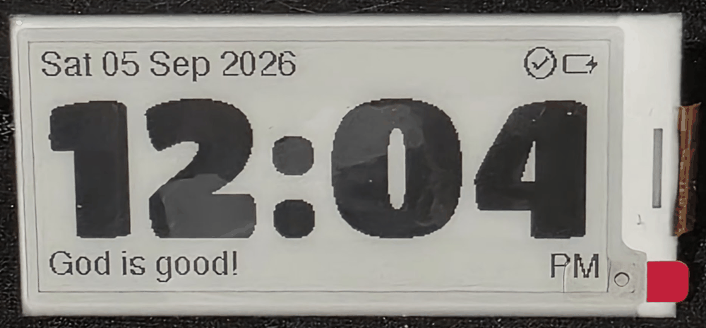
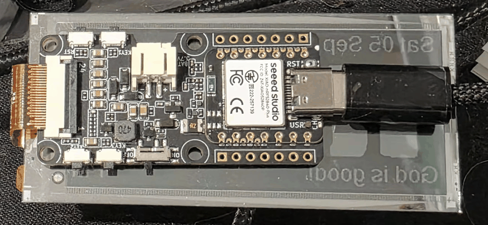

# eClock Desk Stand Enclosure Design Specification

**Status:** Draft / Ready for CAD
**Date:** 2026-09-05
**Form Factor:** Compact Angled Desk Stand (Bedside / Desk Clock)
**Primary CAD Tool:** OnShape
**Export Formats:** STEP (master), STL/3MF (printing)

---

## 1. Hardware Stackup & Photographic Reference

### 1.1 Front View (Active Display Face)


* **Viewing Active Area:** Centred active ink area (`66.9 mm × 29.1 mm`).
* **Ribbon Bend & Overhang:** On the **right edge**, the 24-pin FPC ribbon wraps around the glass with an outward bend radius that protrudes **~0.8 to 1.5 mm beyond the glass perimeter**. The bezel **must** have a dedicated relief pocket here to prevent pinching traces.
* **Asymmetric Border:** Notice that the white border on the left is ~5.5 mm, whereas the border on the right (incorporating the flex bond and red pull tab) is wider (~7.0 mm). The bezel cutout must center on the **active ink**, not the glass rectangle.

### 1.2 Rear View (Board & Connector Stackup)


* **Mechanical Coupling:** The FPC ribbon is short (~10–12 mm) and folds directly into the ZIF socket (J1). This locks the board's lateral position: the EN05 PCB sits against the back of the glass with its ZIF socket right at the ribbon fold edge.
* **Component Orientation:**
  * **USB-C Port:** Points towards the **left edge** of the clock (when viewed from the front).
  * **FPC Ribbon:** Extends from the **right edge** of the clock (when viewed from the front).
  * **KEY1 (User Wake/Sync Button) & Battery JST:** Located along the **top edge**.
  * **Power Slide Switch & KEY2/KEY3:** Located along the **bottom edge**.
* **Vertical Offset:** The 25.0 mm high EN05 PCB sits biased towards the top edge of the 36.7 mm glass panel, leaving ~11 mm of bare glass backing exposed along the bottom.

---

## 2. Hardware Envelope & Component Dimensions

### 2.1 ePaper Display Module (Good Display GDEY029T94)
* **Glass Outer Dimensions:** 79.0 mm (W) × 36.7 mm (H) × 1.2 mm (D, ~1.4 mm with tape)
* **Active Viewing Area:** 66.9 mm (W) × 29.1 mm (H)
* **Ribbon Cable (FPC) Bend Allowance:** Requires a **2.0 mm wide × 18 mm tall relief channel** on the right side of the inner pocket so the bent polyimide flex floats freely in air.

### 2.2 Driver Board (Seeed XIAO ePaper Display Board EN05 + XIAO nRF52840 Plus)
* **PCB Outline:** 52.66 mm (W) × 25.00 mm (H) × 1.2 mm (PCB thickness)
* **Total Depth (with XIAO + FPC connector + JST):** ~6.5 mm
* **Mounting Holes (4×):** 2.5 mm diameter (clearance for M2 screws)
  * Top edge spacing: 27.09 mm (X = 23.07 mm to 50.16 mm, Y = 2.00 mm)
  * Bottom edge spacing: 27.16 mm (X = 23.00 mm to 50.16 mm, Y = 23.00 mm)
  * Vertical hole spacing: 21.00 mm
* **Key I/O Locations (relative to PCB top-left (0,0)):**
  * **USB-C Port:** Centred at X = 0.0 mm (flushed/extending slightly past left edge), Y = 12.63 mm (vertical centre).
  * **Power Slide Switch (SW6):** Bottom edge, slides horizontally.
  * **KEY1 Button (User Wake/Sync - D9):** Top edge, tactile click.
  * **JST 2.0mm LiPo Connector (J3):** Horizontal insertion.
  * **FPC 24-Pin Connector (J1):** Left/Right edge depending on PCB top vs bottom reference.

### 2.3 LiPo Battery
* **Dimensions:** 41.0 mm (L) × 19.0 mm (W) × 5.0 mm (T)
* **Capacity:** 500 mAh (3.7V single-cell)
* **Connector:** 2-pin JST-PH 2.0mm pigtail (~30–50 mm lead length)
* **Placement:** Sits in the lower base / rear cavity of the angled wedge, keeping the centre of gravity low and stable.

---

## 3. Desk Stand Geometry & Ergonomics

* **Tilt Angle:** **70° from horizontal (20° backward tilt from vertical)**.
  * Proven standard for bedside and desk clocks for glare-free glanceability from sitting and standing heights.
* **Centre of Gravity:** Kept low and rearward so pushing the top wake button does not tip the stand backward.
* **Footprint / Base:** Integral rubber feet recesses (4× 6–8 mm silicone stick-on bumper pads) on the base to prevent sliding when pressing buttons.
* **Target Outer Dimensions:**
  * Width: ~88–92 mm (allows 4–5 mm perimeter walls, FPC relief, and screw bosses)
  * Height: ~45–48 mm
  * Base Depth: ~22–26 mm (wedge / angled profile)

---

## 4. Openings & Actuators

1. **Display Bezel Window:**
   * Cutout: **67.5 mm × 29.5 mm** centered on the **active display ink**, not the outer glass.
   * Inside stepped ledge: **79.6 mm × 37.3 mm × 1.5 mm deep** with an extra **2.0 mm relief notch** on the ribbon edge.
   * A 0.5–1.0 mm insulating barrier/standoff prevents raw PCB pads from pressing directly on the rear glass surface.
2. **USB-C Charging & DFU Port:**
   * Cutout on the **left side** of the enclosure.
   * Minimum clearance cutout: **12.5 mm × 7.5 mm** with chamfered lead-in to accommodate chunky third-party USB-C cable overmolds.
3. **Primary Wake / Re-sync Button (D9):**
   * Placed on the **top roof** of the enclosure via a captive 3D-printed plunger or compliant flexure aligned over `KEY1`.
4. **Hardware Power Slide Switch:**
   * Recessed slot on the bottom base or side to prevent accidental power-off while remaining switchable.
5. **Reset Pinhole:**
   * 1.5 mm pinhole aligned with the XIAO reset button for firmware recovery/bootloader access without disassembly.

---

## 5. Mechanical Construction: 2-Part Shell + Intermediate Carrier Spacer

To completely protect the fragile glass and ribbon while giving a rock-solid feel when pressing buttons, the architecture uses **two outer shell parts plus an internal carrier spacer**:

```
[ FRONT BEZEL ]  <-- Captures glass window from front with right-side ribbon relief
   |
   | (ePaper Display Glass Panel)
   |
[ INTERMEDIATE CARRIER SPACER ]  <-- Snaps/drops onto back of bezel over the glass
   |  - 4x locating pins engage EN05 PCB mounting holes (27.1 x 21.0 mm)
   |  - Absorbs button push forces so ZERO load touches the glass
   |  - Locks lateral distance to prevent pulling or straining the FPC ribbon
   |  - Isolates PCB solder points from bare glass backing
   |
(EN05 Board + 41x19x5mm Battery)
   |
[ REAR ANGLED STAND ]  <-- Tool-less snap fit to front bezel; encloses battery & supports stand
```

### 5.1 Front Bezel (Aesthetic Faceplate)
* **Aesthetic Face & Window:** Front aperture (`67.5 mm × 29.5 mm`) centered on active ink.
* **Internal Glass Pocket:** Perimeter step `79.6 mm × 37.3 mm × 1.5 mm deep`.
* **FPC Ribbon Relief:** 2.0 mm wide outward pocket along the right inner wall so the ribbon bend never touches plastic.
* **Snap Detents:** Undercut catches along the perimeter for the rear stand's cantilever snap lugs.

### 5.2 Intermediate Carrier Spacer (Load-Bearing Core)
* **What it solves:**
  1. **Direct button load isolation:** When pressing `KEY1` (wake) or sliding `SW6`, pressing forces are transferred straight into the spacer and bezel frame—**zero mechanical force reaches the glass**.
  2. **Ribbon strain relief:** The spacer holds the EN05 PCB at an exact, fixed distance from the glass edge using locating pins, so the ribbon cannot get tugged, compressed, or fatigued.
  3. **Electrical & scratch insulation:** Prevents rough through-hole pins, solder bumps, or sharp component corners on the PCB from scratching or puncturing the display backing.
* **Key Features:**
  * **4× Integrated Locating / Alignment Pins:** 2.3 mm diameter pins matching the EN05 PCB mounting holes (spaced 27.1 mm × 21.0 mm) that locate and hold the board firmly without needing screws.
  * **Cutouts for components:** Recesses for any underside SMD components so the PCB sits flush.
  * **Thickness:** 1.2–1.5 mm plate with perimeter rim registering against the front bezel shelf.

### 5.3 Rear Angled Stand (Chassis + Stand Base)
* **Snap-Fit Retention:** Cantilever snap tabs that click into the front bezel.
* **Rear Clamping Ribs:** Gently press the EN05 PCB onto the spacer's locating pins when closed.
* **Battery Bay:** Dedicated cradle in the lower wedge base (`41.8 mm × 19.8 mm × 5.2 mm`) with JST wire routing channel.
* **I/O Access:**
  * Left side: USB-C port cutout (`12.5 mm × 7.5 mm` with lead-in chamfer).
  * Bottom base: Power slide switch cutout (`SW6`).
  * Top edge: `KEY1` button actuator opening.
  * Rear/side pinhole: 1.5 mm reset button access.

---

## 6. Snap-Fit Tolerances & Guidelines (FDM Printing)

* **Cantilever Snap Lug Proportions:**
  * Length: 8.0–10.0 mm
  * Thickness: 1.2–1.5 mm at base, tapering slightly to 1.0 mm at the tip
  * Engagement hook depth: 0.5–0.6 mm (sufficient hold in PETG/PLA without brittle snap-off during release)
  * Lead-in angle: 30° (easy insertion)
  * Retention angle: 60°–75° (secure lock, but permits intentional pry-open)
* **Print Orientation:**
  * **Front Bezel:** Face down on print bed (clean outer finish, snap recesses on vertical walls).
  * **Rear Stand:** Bottom base flat on print bed (snap lugs print vertically in Z; use PETG for layer adhesion strength).

* **Material:** PETG or PLA+ (PETG preferred for long-term creep resistance on heat-set inserts).
* **Layer Height:** 0.16 mm – 0.20 mm (0.16 mm for clean bezel front surface and button flexure).
* **Walls/Perimeters:** 3–4 walls (minimum 1.2–1.6 mm wall thickness).
* **Infill:** 20% Gyroid or Grid.
* **Orientation:**
  * Front Bezel: Print face-down on a textured PEI sheet for a clean, matte front surface.
  * Rear Stand: Print on its bottom base or back face with minimal supports.
